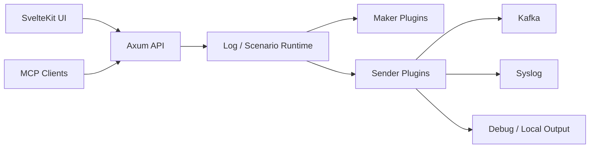

# LogMaker

[](https://www.rust-lang.org/)
[](https://github.com/tokio-rs/axum)
[](https://svelte.dev/)
[](./LICENSE)

LogMaker is a plugin-based log simulation platform for generating, routing, and orchestrating synthetic logs. Use the web UI to create data with Makers, compose messages with Log templates, and deliver output through Senders such as Kafka, Syslog, or Debug.

The server is written in Rust and ships as a single binary with the web UI embedded.

## Highlights

- **Visual log builder**: Combine `<maker_name>` tokens into log formats and verify output with live preview.
- **Scenario orchestration**: Run multiple Logs in sequence with per-step Senders and field overrides.
- **Shared variables**: Reuse generated Maker values across a Scenario to model correlated flows such as login, activity, and logout.
- **Plugin architecture**: Extend Maker and Sender types with native plugin libraries built against `plugin-api`.
- **MCP automation**: Automate dashboard checks, import/export, plugin installation, and scenario creation through the MCP server and Codex Skill.
- **Operational UI**: Monitor dashboards, start/stop workloads, inspect EPS/BPS, import/export definitions, and use responsive dark-mode screens.

## Core Concepts

| Concept | Description |
| --- | --- |
| Maker | Data source that emits values such as IP, Date, Regex, UUID, or Pick |
| Sender | Delivery target that sends generated logs to Debug, Syslog, Kafka, or custom outputs |
| Log | Template and rate definition built from Maker tokens and static text |
| Scenario | Ordered workflow that executes multiple Log steps |
| Override | Step-level replacement of a Log field with a literal value or shared variable |
| Plugin | Native library (`.so` / `.dylib` / `.dll`) that provides new Maker or Sender types |

Built-in types (`default-plugin`):

| Makers | Senders |
| --- | --- |
| `Date`, `IP`, `IPRange`, `NumberRange`, `Pick`, `Regex`, `UUID` | `Debug`, `Syslog` (UDP, RFC 3164/5424/5425), `Kafka` |

## Architecture

```text
logmaker/
├── core/              # Axum REST API, log/scenario runtime, embedded UI (binary: logmaker)
├── plugin-api/        # Maker/Sender traits and the plugin C ABI
├── default-plugin/    # Built-in makers and senders
├── examples/
│   └── sample-plugin/ # Example external plugin (Counter maker, File sender)
├── ui/                # SvelteKit frontend, built into core/static
├── mcp-server/        # MCP server for automation clients
├── helm/              # Helm chart
└── k8s/               # Kubernetes manifests
```



### Runtime Model

- Core stores Maker, Sender, Log, and Scenario definitions as JSON files in the data root.
- Each running Log has its own thread that paces generation per second (events or bytes per second, minute, hour, or day). Logs can be paused and resumed without deleting configuration.
- Updating a Maker or Sender swaps its instance in place, so running Logs pick up the change immediately. Makers and Senders used by a Log or Scenario cannot be deleted.
- Scenarios route delivery through each step's `senders`; legacy scenario-level senders are ignored.
- Log formats only substitute `<maker_name>` tokens; everything else is literal text. Step overrides may reference shared variables with `$name`, `${name}`, `$!name`, or `$!{name}`.
- Import/export endpoints use the same JSON shapes as the UI.

## Quick Start

### Requirements

- Rust 1.85+ (`cargo`)
- Node.js 18+

### Build and Run

```bash
git clone https://github.com/m8928/logmaker.git
cd logmaker

cd ui
npm install
npm run build        # writes the UI to core/static
cd ..

cargo build --release -p logmaker-core
./target/release/logmaker
```

Open [http://localhost:19999](http://localhost:19999).

The UI is embedded at compile time; rebuild the server after rebuilding the UI. Without a UI build the server still runs and serves the API.

### Configuration

| Option | Environment | Default | Description |
| --- | --- | --- | --- |
| `--port` | `LOGMAKER_PORT` | `19999` | HTTP port |
| `--bind` | `LOGMAKER_BIND` | `0.0.0.0` | Listen address |
| `--data-root` | `LOGMAKER_DATA_ROOT` | `~/.logmaker-data` | Maker/Sender/Log/Scenario JSON files |
| `--plugin-root` | `LOGMAKER_PLUGIN_ROOT` | `~/.logmaker-plugin` | Plugin libraries, loaded at startup |
| `--log-dir` | `LOGMAKER_LOG_DIR` | `logs` | Daily-rotated log files (30 kept); empty disables file logging |
| | `RUST_LOG` | `info` | Log filter, e.g. `info,logmaker::debug_sender=warn` |

The Java-style flags `--server.port`, `--data.root`, and `--plugin.root` are accepted as aliases.

### Development Mode

Run the backend:

```bash
cargo run -p logmaker-core
```

Run the frontend with Vite proxying `/api/v1` to `127.0.0.1:19999`:

```bash
cd ui
npm install
npm run dev
```

Open [http://localhost:5173](http://localhost:5173).

## MCP Server

The MCP server exposes LogMaker operations to MCP-compatible clients. It supports dashboard reads, Maker/Sender/Log/Scenario CRUD, import/export, plugin install/delete, log preview, and start/stop operations.

```bash
cd mcp-server
npm install
npm run build
LOGMAKER_URL=http://localhost:19999 npm start
```

Example Claude Code registration from the repository root:

```bash
claude mcp add logmaker \
  -e LOGMAKER_URL=http://localhost:19999 \
  -- node "$PWD/mcp-server/dist/index.js"
```

This repository also includes a project-local Codex Skill at `.codex/skills/logmaker` with LogMaker-specific MCP usage guidance.

## API

Mutating endpoints return `{"type": "SUCCESS" | "ERROR", "message": "...", "notification": true}` with status 200 (success) or 400 (error). Import endpoints return one such result per item.

| Endpoint | Method | Description |
| --- | --- | --- |
| `/api/v1/dashboard` | GET | Dashboard metrics |
| `/api/v1/maker` | GET/POST | List or create Makers |
| `/api/v1/maker/{name}` | PUT/DELETE | Update or delete a Maker |
| `/api/v1/maker:import` | POST | Import Maker JSON |
| `/api/v1/maker:import-file` | POST | Import Maker JSON file |
| `/api/v1/sender` | GET/POST | List or create Senders |
| `/api/v1/sender/{name}` | PUT/DELETE | Update or delete a Sender |
| `/api/v1/sender:import` | POST | Import Sender JSON |
| `/api/v1/sender:import-file` | POST | Import Sender JSON file |
| `/api/v1/log` | GET/POST | List or create Logs |
| `/api/v1/log/{name}` | PUT/DELETE | Update or delete a Log |
| `/api/v1/log/{name}:start` | POST | Resume a Log |
| `/api/v1/log/{name}:stop` | POST | Pause a Log |
| `/api/v1/log:preview` | POST | Preview Log output |
| `/api/v1/log:import` | POST | Import Log JSON |
| `/api/v1/log:import-file` | POST | Import Log JSON file |
| `/api/v1/plugin` | GET/POST | List or upload Plugins |
| `/api/v1/plugin/maker` | GET | List available Maker types |
| `/api/v1/plugin/sender` | GET | List available Sender types |
| `/api/v1/plugin/{name}` | DELETE | Delete a Plugin |
| `/api/v1/scenario` | GET/POST | List or create Scenarios |
| `/api/v1/scenario/{name}` | PUT/DELETE | Update or delete a Scenario |
| `/api/v1/scenario/{name}:start` | POST | Start a Scenario |
| `/api/v1/scenario/{name}:stop` | POST | Stop a Scenario |
| `/actuator/health` | GET | Health probe (`{"status":"UP"}`) |

## Testing

```bash
# Server, plugin API, built-in plugin, and native plugin loading tests
cargo test --workspace

# Lints
cargo fmt --all --check
cargo clippy --workspace --all-targets -- -D warnings

# Frontend type and build checks
cd ui
npm run check
npm run build

# MCP server build
cd ../mcp-server
npm run build
```

Some tests open local UDP sockets and build `examples/sample-plugin`; in restricted sandboxes, allow local socket creation.

## Plugin Development

Plugins implement the `MakerFactory` / `SenderFactory` traits from `plugin-api`, are built as a `cdylib`, and are uploaded on the Plugin page (or placed in the plugin root). The built-in `default-plugin` and `examples/sample-plugin` are reference implementations.

See [plugin.md](./plugin.md) for the plugin development guide.

## Migrating from the Java Edition

- **Data files** (`makers.json`, `senders.json`, `logs.json`, `scenarios.json`) are read as-is; point `--data-root` at the existing directory. Files written by this edition remain readable by the Java edition.
- **Entries that cannot be loaded** (for example a Maker whose plugin type is not installed, and the Logs and Scenarios using it) are logged at startup and kept in the data files unchanged, so they come back once the type is available.
- **Date patterns** keep their Java meaning: `SimpleDateFormat` for the `Date` maker, `DateTimeFormatter` (`java.time`) for the Kafka `indexPattern`.
- **Plugins**: Java plugin JARs are not loaded (they are skipped with a warning). Rebuild custom plugins against `plugin-api`.
- **Argument types** in `/api/v1/plugin/maker` and `/api/v1/plugin/sender` are reported as `string`, `integer`, `number`, `boolean`, and `list` instead of Java class names.
- **Templates**: log formats no longer pass through Velocity, so `#directives` and `$references` in formats stay literal. Shared-variable references in step overrides work as before.
- **Sender limit** is now applied on update as well as on create.
- Swagger UI is not provided; the endpoint table above lists the API.

## Deployment

Deployment assets are included for container and Kubernetes environments:

- [Dockerfile](./Dockerfile)
- [k8s](./k8s)
- [helm/logmaker](./helm/logmaker)

`script/startup.sh` and `script/shutdown.sh` run the binary in the background with `./data` and `./plugins` next to it.

## License

LogMaker is licensed under the [Apache License 2.0](./LICENSE).
